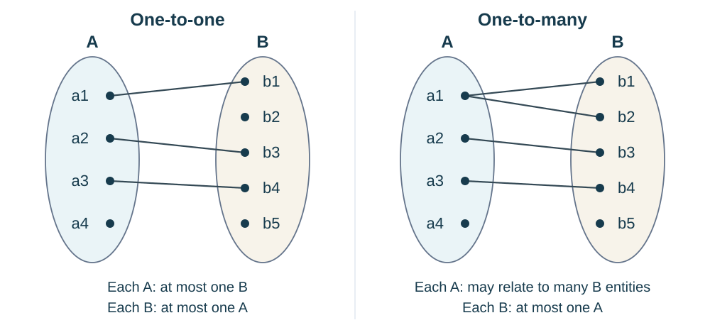
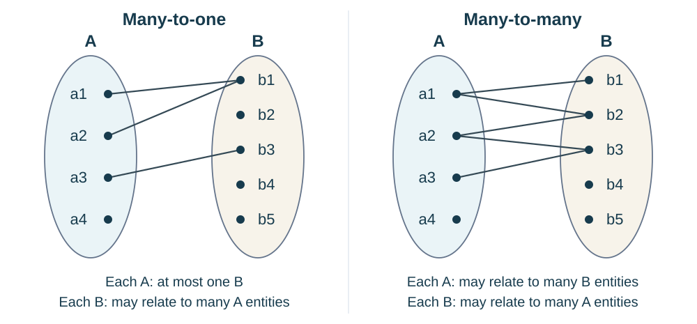
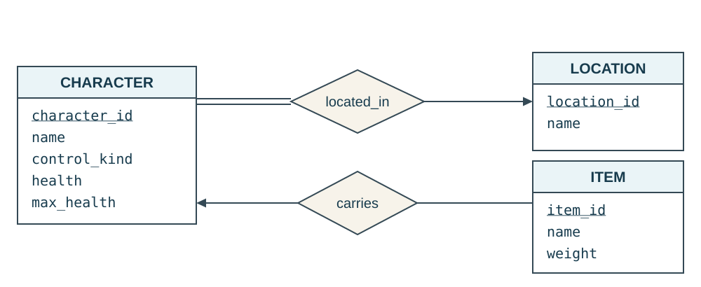
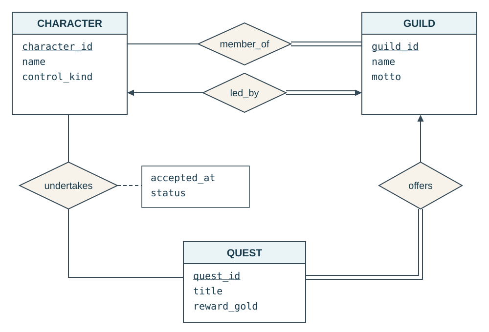

::: {.lesson-hero}
::: {.lesson-kicker}
WEEK 6 · ER MODELING FOUNDATIONS
:::

# What must a game remember about its world?

A character enters a village, picks up a sword, joins a guild, and accepts a quest. The game must remember the character, their possessions, and their progress. Before choosing tables, we need a model of those objects and the rules connecting them.
:::

**Previous:** [Joining tables with SQL](week-06-joining-tables-with-sql.qmd).

This first ER lecture follows the core concepts and diagram notation of *Database System Concepts*, 7th edition, [Chapter 6](https://www.db-book.com/slides-dir/PDF-dir/ch6.pdf). We build an original game-world example in stages. Later lectures will extend the model and convert it into relational schemas.

## 1. Start with the game rules

**Question:** What information must persist when we save and reload this game world?

For our first model, assume:

- A **character** is an individual in the world, including a player-controlled character or a non-player character (NPC).
- Every character is currently in exactly one named location, such as Ashvale Village or the Old Mine. A location can be empty.
- An **item** is an individual object, such as one particular sword or potion. Two swords with the same name are still different items.
- A character may carry several items or none. An individual item can be carried by at most one character at a time.
- Items without a carrier are allowed. We will add ground and storage locations for those items in a later version.
- Characters have names and stats; items have names, weights, and other properties. Names need not be unique.

Next, add some social and quest rules:

- A **guild** is an organization, such as the Lantern Watch. A character may belong to at most one guild; every guild has at least one member.
- Every guild has exactly one leader. A character may lead at most one guild, and must be a member of the guild they lead.
- A **quest** is a task offered by exactly one guild, such as “Light the Old Beacon.” A guild may offer several quests or none.
- A character may undertake many quests, and many characters may undertake the same quest. Some characters have no quests, and some quests have no participants.
- Record each character's quest status separately. For now, a character can undertake a particular quest only once; completed or abandoned attempts stay in the record.

We model one game world: current locations, inventories, and guild memberships, plus retained quest progress. Movement history, repeatable quests, and item stacks would require further design decisions.

These are requirements, not conclusions drawn from a few example records. A sample can expose a violated rule; it cannot establish every rule that future data must obey.

::: {.callout-note appearance="simple"}
An **entity-relationship model**, or **ER model**, supports conceptual design. Its diagram makes the model visible; written requirements explain assumptions the drawing cannot fully capture.
:::

## 2. Entities and entity sets

An **entity** is one distinguishable object in the application. It can be a person, a digital object, or an event; it need not be a physical thing.

An **entity set** is a collection of entities with the same kind of properties. A diagram describes these sets and their rules, rather than drawing a separate box for every current object.

| One entity | Entity set | What distinguishes this entity? |
|---|---|---|
| Mira, a player-controlled ranger | `CHARACTER` | `character_id = 101` |
| Tobin, an NPC blacksmith | `CHARACTER` | `character_id = 102` |
| One particular iron sword | `ITEM` | `item_id = 501` |
| Another iron sword | `ITEM` | `item_id = 502` |
| Ashvale Village | `LOCATION` | `location_id = 10` |
| The Lantern Watch | `GUILD` | `guild_id = 20` |
| Light the Old Beacon | `QUEST` | `quest_id = 301` |

**Discuss:** Why would an item name be insufficient to identify the sword Mira is carrying?

Possible reasoning

Items 501 and 502 can both be named “Iron Sword.” They may have different carriers or durability values. Giving each item its own identity preserves that distinction. We will later separate an individual item from an item type that describes shared properties.

An NPC is an entity, just as a player-controlled character is. Whether NPCs need a separate entity set, a character attribute, or a specialized character type is a design question we can revisit as requirements grow.

## 3. Attributes describe entities

An **attribute** records a property of an entity. Its **domain** describes the values that property can take.

| Entity set | Identifier | Example attributes |
|---|---|---|
| `CHARACTER` | `character_id` | `name`, `control_kind`, `health`, `max_health`, `base_strength` |
| `ITEM` | `item_id` | `name`, `weight`, `durability` |
| `LOCATION` | `location_id` | `name`, `description` |
| `GUILD` | `guild_id` | `name`, `motto` |
| `QUEST` | `quest_id` | `title`, `description`, `reward_gold` |

For this game:

- `control_kind` is either `player` or `npc`.
- Health must be between zero and the character's maximum health.
- Item weight is nonnegative, in the game's chosen weight units.
- `reward_gold` is the nonnegative amount awarded to a character for completing a quest.

These meanings come before the PostgreSQL types. A quest's title and reward describe the shared task; one character's progress on it describes an association.

### Identify objects reliably

Keys carry over from our relational-model discussion:

- A **candidate key** is a minimal set of attributes that distinguishes every entity in the set.
- We choose one candidate key as the **primary key**. Here, `item_id` is the chosen key for items.
- A name is descriptive; our requirements allow different items or characters to share a name.
- An ID does not explain an object's relationships. Knowing an item's ID alone does not tell us who carries it.

We will mark chosen keys in the diagram without choosing `integer`, `bigint`, or a generation strategy yet.

### Some properties need more thought

The book also distinguishes several attribute forms:

- **Composite:** a property with meaningful components, such as a world position containing `x`, `y`, and `z` coordinates.
- **Multivalued:** a property with several values for one entity, such as an item's descriptive tags: `metal`, `sharp`, and `quest-related`.
- **Derived:** a property calculated from other information, such as effective strength computed from base strength and equipment bonuses.

These are modeling distinctions. A multivalued property is not an instruction to put a comma-separated list in one SQL column. We will return to their representation later.

## 4. Relationships connect entities

A **relationship** associates particular entities. A **relationship set** describes a collection of those associations.

For example, `carries` connects characters to items:

| Character entity | Item entity | One relationship instance |
|---|---|---|
| Mira, character 101 | Iron Sword, item 501 | Mira carries sword 501. |
| Mira, character 101 | Healing Potion, item 503 | Mira carries potion 503. |
| Tobin, character 102 | Iron Sword, item 502 | Tobin carries sword 502. |

A second relationship, `located_in`, connects characters to locations. Both are **binary relationships**: each association involves two entities. The complete model can contain many such relationships.

- Give each relationship a name that communicates its meaning.
- Distinguish **carrying** an item from **equipping** it. An inventory can contain a sword that is not currently equipped.
- A SQL join retrieves related facts; it does not itself establish the application's relationship or enforce its rules.

In this first model, a character's inventory is the collection of items connected through `carries`. We do not need a separate `INVENTORY` entity merely because the game interface has an inventory screen. Separate bags, containers, or storage capacities could create a reason to add one.

## 5. How many associations are allowed?

For **each direction** of a binary relationship, ask two questions:

1. What is the **maximum** number of related entities?
2. Is an association **required**, or can there be none?

### Mapping cardinality describes the maximum

| Cardinality | Meaning | Example under an explicit game rule |
|---|---|---|
| One-to-one | At most one on either side | Each guild has at most one leader; each character leads at most one guild. |
| One-to-many | One object can relate to many on the other side | A character can carry many items; an item has at most one carrier. |
| Many-to-one | The same pattern read in the other direction | Many items can be carried by one character. |
| Many-to-many | Multiple associations are allowed in both directions | A character can undertake many quests; a quest can have many participating characters. |

Requiring every guild to actually have a leader is a separate **participation** constraint.

“Many” means that multiple associations are allowed, not that every entity must have multiple matches today.

### See the four patterns

These illustrations follow the set-and-connection approach in the book's [mapping-cardinality slides](https://www.db-book.com/slides-dir/PDF-dir/ch6.pdf#page=21), using original example instances. Read each pattern **from A to B**.

- Each oval contains an **entity set**; each labeled dot is one entity.
- Each connecting line is one **relationship instance** between two entities.
- Unconnected dots are allowed here: cardinality describes the maximum, while participation determines whether a match is required.

{fig-alt="Two sample mappings from A to B. One-to-one: a1 connects to b1, a2 to b3, and a3 to b4; no entity has more than one connection. One-to-many: a1 connects to both b1 and b2, a2 to b3, and a3 to b4; each B entity has at most one A partner. Both examples include unconnected entities."}

{fig-alt="Two sample mappings from A to B. Many-to-one: a1 and a2 both connect to b1, while a3 connects to b3; each A entity has at most one B partner. Many-to-many: a1 connects to b1 and b2, a2 to b2 and b3, and a3 to b3; entities on either side can have multiple partners. Both examples include unconnected entities."}

These are **sample instances**, not the ER schema diagrams introduced below. A sample can be compatible with a cardinality rule without proving that rule; the application's requirements determine which future associations are allowed.

### Cardinality depends on what we are modeling

The entity sets alone do not determine cardinality. We must first define **what the relationship represents**, including whether it describes the present or the past.

- **Where is each character now?** `located_in` is **many-to-one** from `CHARACTER` to `LOCATION`: each character has one current location, while a location may contain many characters.
- **Which locations has each character visited?** `has_visited` would be **many-to-many**: a character may have visited many locations, and each location may have been visited by many characters.

If Mira moves from Ashvale Village to the Old Mine, her current-location association changes. A visited-locations relationship would retain both places.

**Our diagram uses `located_in` to model the present state.** Neither cardinality is universally correct for characters and locations; each answers a different question. Recording every separate visit, including return visits and times, would require more detail than a list of character–location pairs.

### Participation describes whether an association is required

In the `located_in` relationship:

- `CHARACTER` has **total participation**: every character must have a current location.
- `LOCATION` has **partial participation**: a location is allowed to have no characters.

In `carries`, both sides have **partial participation**: a character can have an empty inventory, and an item can have no carrier.

**Check:** If every current location contains a character, does location participation become total?

Possible answer

No. Partial participation allows empty locations, even when none happen to be empty now. The requirement, not the current contents, determines the constraint.

## 6. Draw and read the model

### Our diagram legend

We will use the book's **arrow notation**, consistently across these diagrams. Select a diagram to enlarge it.

| Symbol | Meaning |
|---|---|
| Rectangle | An entity set; its attributes appear inside. |
| Solid underline beneath an attribute | A chosen primary-key attribute. Underline all attributes if the key is composite. |
| Diamond | A relationship set. |
| Arrow from a relationship toward an entity set | The **one** side: an entity on the opposite side can be associated with **at most one** entity here. |
| Connection without an arrowhead | The **many** side: multiple related entities are allowed. |
| Single connection line | **Partial participation**: an entity on this connection may have no association. |
| Two parallel connection lines | **Total participation**: every entity on this connection must participate in at least one association. |
| Attribute box attached to a diamond by a dashed line | Attributes of the relationship, rather than of either entity set. |

**Arrows describe the maximum; single or double lines describe participation.** An arrow does not mean “exactly one,” indicate data flow, or specify a SQL join direction.

For a binary relationship:

- Arrows toward **both** entity sets mean one-to-one.
- An arrow toward **only one** entity set means many-to-one toward that set (or one-to-many read in reverse).
- **No arrows** mean many-to-many.

### Characters, locations, and items

{fig-alt="CHARACTER participates totally in located_in; located_in points to LOCATION. Each character has exactly one location, and a location can contain zero or more characters. carries points to CHARACTER; both sides participate partially. Each item has zero or one carrier, and each character carries zero or more items."}

Read the drawing in both directions:

- **Location:** the arrow points to `LOCATION`, so each character has **at most one** location. The double line beside `CHARACTER` requires a location. Together, these mean **exactly one**.
- **Occupants:** there is no arrow toward `CHARACTER` in `located_in`, so a location may contain many characters. The single line beside `LOCATION` allows it to be empty.
- **Inventory:** the arrow from `carries` points to `CHARACTER`, so an item has at most one carrier. Single lines allow an uncarried item or a character with no items.

Notice that the arrow and double line establishing “each character has exactly one location” appear on **opposite sides** of the relationship diamond. They answer different questions.

**Where are the foreign keys?** Relationships express the associations in this conceptual model. We do not also list a location ID inside `CHARACTER` or a carrier ID inside `ITEM`. Foreign-key columns enter when we convert the model into relations.

Other ER notations, including crow's-foot diagrams, draw cardinality differently. Always check the legend before interpreting an unfamiliar diagram.

## 7. Add guilds and quests

**Question:** How do we distinguish belonging to a guild, leading a guild, and accepting one of its quests?

These are separate relationships, even when they connect the same entity sets. This diagram extends the same `CHARACTER` entity set from above; it omits items and locations to keep the new relationships readable.

{fig-alt="CHARACTER and GUILD are connected by member_of and led_by. member_of points only to GUILD; led_by points to both entities. GUILD has double lines for both relationships. CHARACTER and QUEST have an optional many-to-many undertakes relationship, with accepted_at and status attributes. offers points to GUILD and has a double line to QUEST."}

| Relationship | Rule in both directions | How it appears |
|---|---|---|
| `member_of` | A character belongs to zero or one guild; a guild has one or more members. | Arrow to `GUILD`; double line beside `GUILD`. |
| `led_by` | A guild has exactly one leader; a character leads zero or one guild. | Arrows to both sets; double line beside `GUILD`. |
| `offers` | A guild offers zero or more quests; each quest has exactly one issuing guild. | Arrow to `GUILD`; double line beside `QUEST`. |
| `undertakes` | A character undertakes zero or more quests; a quest has zero or more participating characters. | No arrows; single lines on both sides. |

**One additional rule:** a guild's leader must be one of its members. The separate arrows and lines do not enforce this connection between `led_by` and `member_of`; write it alongside the diagram.

For this game, characters can accept quests from any guild, including one they have not joined. If quests were restricted to guild members, we would need another written rule connecting the relationships.

**Discuss:** If characters could join multiple guilds, which arrow would you remove? Would that also change how many guilds a character can lead?

Possible answer

Remove the arrow from `member_of` to `GUILD`, making membership many-to-many. The double line beside `GUILD` still requires each guild to have members. Leave `led_by` unchanged: membership and leadership have separate constraints.

## 8. Some attributes belong to relationships

### A character's quest progress

**Question:** Can `status` be a single attribute of `QUEST`?

| Character | Quest | accepted_at | status |
|---|---|---|---|
| Mira | Light the Old Beacon | Day 3, 10:00 | active |
| Tobin | Light the Old Beacon | Day 2, 09:00 | completed |
| Mira | Clear the Old Mine | Day 3, 11:00 | abandoned |

The same quest can have different statuses for different characters. The diagram attaches `accepted_at` and `status` to **`undertakes`**:

- `accepted_at`: when this character accepted this quest.
- `active`: the character accepted the quest and is still working on it.
- `completed`: the character satisfied the quest's objectives.
- `abandoned`: the character stopped the attempt without completing it; the attempt remains recorded.

Our “one attempt per character per quest” rule makes one association sufficient. Repeatable quests would require a way to distinguish multiple attempts by the same character.

### When an item was acquired

**Question:** Where should we record when a character acquired an item they currently carry?

| Character | Item | acquired_at |
|---|---|---|
| Mira | Iron Sword 501 | Day 3, 10:00 |
| Mira | Healing Potion 503 | Day 3, 11:00 |
| Tobin | Iron Sword 502 | Day 2, 09:00 |

The acquisition time describes the **carrying association**:

- It is not one date for the whole character: Mira acquired different items at different times.
- It describes when the current carrier acquired the item, rather than when the item was created. If Mira hands the sword to Tobin, that association and acquisition time change.
- We can give `carries` an `acquired_at` attribute. Its eventual table representation depends on how we map the relationship.

If we need every past transfer, one current carrying association is insufficient. Transfers would need their own representation.

Equipment raises a related question: an `equips` relationship could record the slot in which a character equips an item. Rules such as “one item per equipment slot” require more detail than simply labeling the relationship one-to-many.

## 9. Test the model against situations

**For each situation, decide whether the model allows it and identify the rule or symbol you used.**

1. Mira has an empty inventory.
2. The Old Mine contains no characters.
3. Mira carries two different items both named Iron Sword.
4. Mira and Tobin both carry the same item 501 at the same time.
5. Tobin has no current location.
6. Mira belongs to two guilds at once.
7. Mira and Tobin both undertake Light the Old Beacon, but only Tobin has completed it.
8. Mira leads the Lantern Watch but is not a member of it.

Check your reasoning

1. Allowed: the single line beside `CHARACTER` in `carries` permits no items.
2. Allowed: the single line beside `LOCATION` permits no occupants.
3. Allowed: items have separate identities; their names need not be unique.
4. Not allowed: the arrow from `carries` to `CHARACTER` permits only one carrier per item.
5. Not allowed: the double line from `CHARACTER` to `located_in` requires participation.
6. Not allowed: the arrow from `member_of` to `GUILD` permits only one guild per character.
7. Allowed: `undertakes` is many-to-many, and `status` belongs to each association.
8. Not allowed by our written membership rule. The diagram's arrows alone would allow it.

A diagram also has limits. “Health cannot exceed maximum health” and “an equipped item must be in that character's inventory” need additional written constraints. The connections above do not express those rules, and `equips` is not yet part of the drawing.

## 10. Extend the world one requirement at a time

Choose one extension to discuss:

- **Quest prerequisites:** how could one quest require completion of another quest?
- **Repeatable quests:** how would we distinguish a character's first and second attempts?
- **Equipment:** what would connect a character, an item, and an equipment slot?
- **World placement:** how would we locate an item that nobody carries?
- **NPCs:** what additional information might an NPC need, such as dialogue or a patrol route?
- **Item types and stacks:** what is shared by all healing potions, and what describes one potion or a stack?

For the chosen extension, identify a possible entity set or relationship, state its participation counts, and give one example situation the model should allow. Write down any rule that the diagram alone cannot express.

Use the same process when considering a [project application](../projects/capstone.qmd): identify users and their needs, sketch a few entities and relationships, and make assumptions explicit before choosing tables.

**Next in the design sequence:** more cardinality and participation practice; entities versus attributes; relationship roles and recursive relationships; weak entities and specialization; then conversion to relational schemas. The game world gives us examples to revisit throughout that sequence.

## Reference

Silberschatz, Korth, and Sudarshan, *Database System Concepts*, 7th edition, Chapter 6, “Database Design Using the E-R Model.” See the authors' [chapter resources](https://www.db-book.com/slides-dir/) and [Chapter 6 slides](https://www.db-book.com/slides-dir/PDF-dir/ch6.pdf) for the book's terminology and notation. The game-world examples and diagrams here are original course examples.
