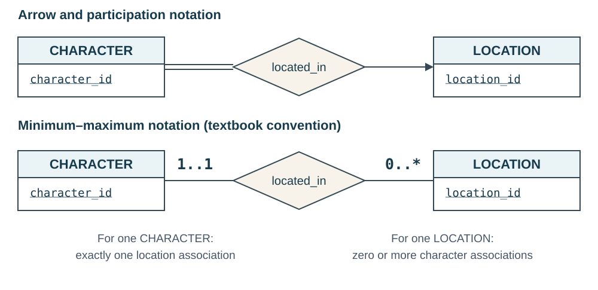
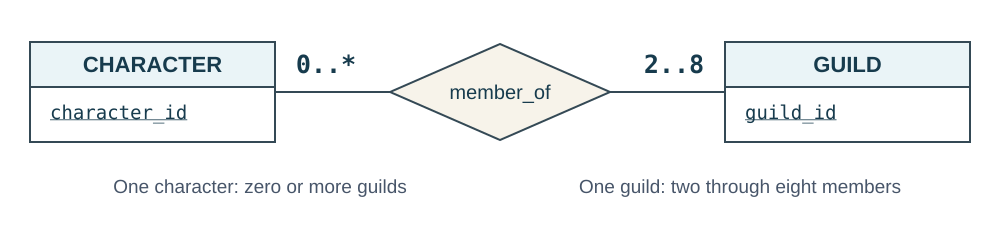
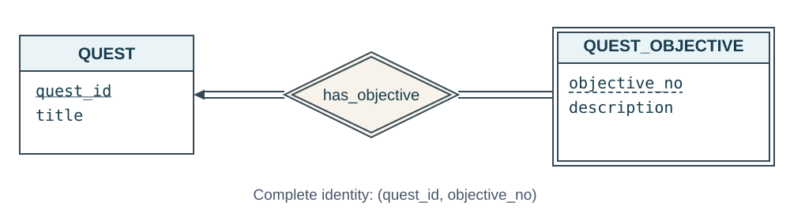

::: {.lesson-hero}
::: {.lesson-kicker}
WEEK 7 · ER CONSTRAINTS AND IDENTITY
:::

# What identifies one association?

Mira undertakes two quests, carries three items, and leads one guild. What identifies each association? The answer depends on how many partners the rules allow.
:::

**Previous:** [Modeling a game world with ER diagrams](week-06-introduction-to-er-diagrams.qmd).

**Focus:** minimum–maximum cardinality and relationship keys, followed by a short extension on weak entities.

## 1. Separate three questions

Recall these rules from the first lecture:

| Relationship | Rule |
|---|---|
| `located_in` | Each character has exactly one current location; a location may be empty. |
| `carries` | A character may carry many items; an individual item has at most one current carrier. Either side may have no association. |
| `member_of` | A character may belong to several guilds or none; every guild has one or more members. |
| `led_by` | Every guild has exactly one leader; a character leads at most one guild. |
| `undertakes` | Characters and quests may have many partners or none. Each character undertakes a particular quest at most once. |

For each relationship, distinguish:

1. **Meaning:** What fact does one association represent?
2. **Counts:** How many associations may or must involve one entity?
3. **Identity:** Which values distinguish one association from every other association in this relationship set?

**Opening question:** Could `character_id` alone identify a character's quest progress? Could it identify that character's current location association?

Possible reasoning

- **Quest progress:** no. One character may have several quests.
- **Current location:** yes. Each character has only one current location.

## 2. Write minimum and maximum together

A range **`a..b`** means **at least `a` and at most `b` associations** for each entity on that connection.

| Range | Meaning for one entity |
|---|---|
| `0..1` | An association is optional; at most one is allowed. |
| `1..1` | Exactly one association is required. |
| `0..*` | Zero or more associations are allowed. |
| `1..*` | At least one association is required, with no stated upper limit. |
| `2..8` | Between two and eight associations, inclusive, are required. |

- **Minimum:** a positive value requires participation.
- **Maximum:** one allows at most one partner in a binary relationship.
- **`*`:** no stated upper bound.

### Read the label beside the entity

In **our notation**, read the range beside an entity as the number of associations involving **one entity of that set**.

{fig-alt="Two equivalent ER diagrams connect CHARACTER to LOCATION through located_in. The upper diagram has a double line beside CHARACTER and an arrow toward LOCATION. The lower diagram uses plain lines with 1..1 beside CHARACTER and 0..* beside LOCATION. Each character has exactly one location; each location has zero or more characters."}

- `1..1` beside `CHARACTER`: one character participates in exactly one `located_in` association.
- `0..*` beside `LOCATION`: one location participates in zero or more `located_in` associations.

::: {.callout-important appearance="simple"}
The **range** beside `CHARACTER` counts its associations. The **arrow** toward `LOCATION` identifies its single partner. These markings go on different sides.
:::

Ranges replace arrows and single/double participation markings. Plain lines in this version do **not** mean partial participation.

### Express a limit arrows cannot show

**Default membership:** `CHARACTER` has `0..*`; `GUILD` has `1..*`.

**New guild-size rule:** require two to eight members per guild. Characters may still join several guilds or none.

{fig-alt="CHARACTER connects to GUILD through member_of, with 0..* beside CHARACTER and 2..8 beside GUILD. A character may belong to zero or more guilds; each guild must have two through eight members."}

A double line beside `GUILD` requires each guild to have members but cannot express “two to eight.” The range supplies both bounds. The relationship is still **many-to-many**.

**Check:** If a guild has two members and one leaves, is the remaining state valid under the new rule?

Possible answer

No: one member is below the minimum. The constraint defines valid states; a separate policy determines what happens when someone leaves.

## 3. Identify a relationship using its participants

The key vocabulary from the relational model applies here:

- A **superkey** identifies every relationship instance uniquely.
- A **candidate key** is a minimal superkey: removing any attribute loses that guarantee.
- A **primary key** is the candidate key we choose to use.

**Basic ER assumption:** each combination of participants occurs at most once in a relationship set. Combining their primary keys gives a **superkey**; cardinality may let us use less.

The following tables display associations for reasoning about keys. SQL table design comes later.

### Many-to-many: a character undertaking a quest

| character_id | quest_id | status |
|---|---|---|
| 101 | 301 | active |
| 101 | 302 | abandoned |
| 102 | 301 | completed |

- **`character_id` alone fails:** a character may undertake several quests.
- **`quest_id` alone fails:** a quest may have several characters.
- **Chosen key:** `(character_id, quest_id)`, because each pair occurs at most once.

::: {.callout-note appearance="simple"}
### A descriptive attribute need not be a key attribute

`status` and `accepted_at` describe the association. Updating an undertaking from active to completed changes its state, not its identity.
:::

### One-to-many: a character carrying items

| character_id | item_id | acquired_at |
|---|---|---|
| 101 | 501 | Day 3, 10:00 |
| 101 | 503 | Day 3, 11:00 |
| 102 | 502 | Day 2, 09:00 |

- **`character_id` alone fails:** a character may carry several items.
- **Chosen key:** `item_id`, because an item has at most one current carrier.
- **The pair is unnecessary:** `(character_id, item_id)` is a superkey, but is not minimal.

An uncarried item has no `carries` association. Optional participation does not create an association with a missing key.

### One-to-one: a guild and its leader

Each guild has one leader; each character leads at most one guild.

- **Candidate keys:** `guild_id` and `character_id`, each on its own.
- **Chosen primary key:** `guild_id`.
- **Remaining constraint:** `character_id` must still be unique in `led_by`.

The pair `(guild_id, character_id)` is a superkey, but is not minimal.

## 4. Derive the key rather than memorize the label

For binary relationships with these mapping constraints:

| Mapping from A to B | Key justified by the mapping | Why it works |
|---|---|---|
| Many-to-many | Combine the keys of A and B. | Either participant may have several partners; the pair identifies the association. |
| One-to-many | Use the key of B, the many side. | Each B participates in at most one association. |
| Many-to-one | Use the key of A, the many side. | Each A participates in at most one association. |
| One-to-one | Either entity's key is a candidate; choose one. | Neither entity can participate in two associations. |

**Composite keys:** carry over every attribute of the entity key. Use distinct names such as `character_id` and `quest_id`.

::: {.callout-tip appearance="simple"}
### Test a proposed key

1. Can two **allowed** associations share its values? If yes, it is not a key.
2. Does removing an attribute preserve uniqueness? If yes, it is not minimal.

Use the requirements, not just the sample rows.
:::

### Revisit guild membership

**Default:** characters may join several guilds, and guilds may have several members. The key of `member_of` is **`(character_id, guild_id)`**.

**Require membership:** changing `0..*` to `1..*` makes participation mandatory. It remains many-to-many, with the same key. **Minimum counts do not determine these keys.**

### What if a character could belong to only one guild?

- **Range:** `0..1` beside `CHARACTER`; guild limits stay the same.
- **Arrow notation:** add an arrow toward `GUILD`.
- **Mapping:** many-to-one from character to guild.
- **New key:** `character_id` alone; the pair is no longer minimal.

Requiring exactly one guild changes `0..1` to `1..1`, but leaves the key unchanged. This is a hypothetical restriction; our default allows multiple memberships.

## 5. Recognize when a pair no longer represents the fact

Now change the quest rule: Mira can complete quest 301 and later undertake it again. We need to retain both attempts.

**Problem:** `(101, 301)` identifies one association. Adding `status` or `accepted_at` does not create a second attempt.

**Possible redesign: introduce `QUEST_ATTEMPT`.**

- Attributes: `attempt_id`, acceptance time, and status.
- Each attempt connects to exactly one character and one quest.
- Several attempts may connect the same character–quest pair.

Before choosing a relationship key, ask whether **one association per participant pair** captures what the system must remember.

## 6. Weak entities: identify an entity through its owner

**Question:** The game designer says “objective 1.” Which quest's objective is that?

Add quest objectives under these rules:

- Every quest has at least one objective.
- Every objective belongs to exactly one quest and cannot exist independently of it.
- `objective_no` is unique **within a quest**, but different quests reuse numbers.

| quest_id | objective_no | description |
|---|---|---|
| 301 | 1 | Find the beacon tower. |
| 301 | 2 | Light the beacon. |
| 302 | 1 | Enter the Old Mine. |

**Complete key:** `(quest_id, objective_no)`. The local number alone can repeat across quests; descriptions need not be unique.

- **Weak entity:** `QUEST_OBJECTIVE`, identified through its owner.
- **Identifying entity:** `QUEST`, the owner.
- **Discriminator (partial key):** `objective_no`, unique within one quest.
- **Identifying relationship:** `has_objective`, which supplies the owner.

{fig-alt="QUEST has primary key quest_id. QUEST_OBJECTIVE has a double rectangle and dashed underline beneath its discriminator objective_no. The double-diamond has_objective relationship points toward QUEST. Double lines on both sides express our rule that every objective has an owner and every quest has at least one objective. An objective's complete key is quest_id together with objective_no."}

| Marking | Meaning |
|---|---|
| Double rectangle | Weak entity set. |
| Dashed underline under `objective_no` | Discriminator, unique within one owner. |
| Double diamond | Identifying relationship. |
| Arrow toward `QUEST` | Each objective has at most one owner. |
| Double line beside `QUEST_OBJECTIVE` | Each objective must have an owner. |

### Read the ownership constraint

- **Objective participation is total:** every objective needs its owner (`1..1`).
- **Quest participation is total here:** our game requires at least one objective (`1..*`). This is an additional rule, not a requirement of all weak-entity designs.
- **The diagram supplies `quest_id` through ownership.** The eventual objective relation includes it in the complete key.

A mandatory relationship alone does not make an entity weak; the owner contributes to its identity.

**Check:** Is `quest_id` alone a key for `has_objective` because it is on the arrow's side?

Possible answer

No. A quest may have several objectives. Use the **complete key of the many side**, `QUEST_OBJECTIVE`: `(quest_id, objective_no)`.

## 7. Check your model before mapping it to tables

Explain each answer using a rule rather than the current sample data:

1. Where do `1..1` and `0..*` go in the current-location diagram?
2. Why does `carries` use `item_id`, while `undertakes` uses two entity keys?
3. Why does adding `status` not create a second undertaking of the same quest?
4. If you covered weak entities, why is objective 1 of quest 301 different from objective 1 of quest 302?

Check your explanations

1. `1..1` beside `CHARACTER`; `0..*` beside `LOCATION`. The ranges count each nearby entity's associations.
2. An item has at most one current carrier. Both a character and a quest can have several `undertakes` partners, so that relationship needs both IDs.
3. Status is a property of the association. Repeated attempts require a representation that distinguishes attempt occurrences.
4. `objective_no` is unique only within its owner. Their complete keys are `(301, 1)` and `(302, 1)`.

**Next:** map the ER model to relations while preserving its keys and constraints. A relationship does not necessarily need its own SQL table.

## Reference and reading

Based on Silberschatz, Korth, and Sudarshan, *Database System Concepts*, 7th edition, Chapter 6, “Database Design Using the E-R Model.”

[Course resources](../resources.qmd) · [Chapter 6 slides](https://www.db-book.com/slides-dir/PDF-dir/ch6.pdf)
