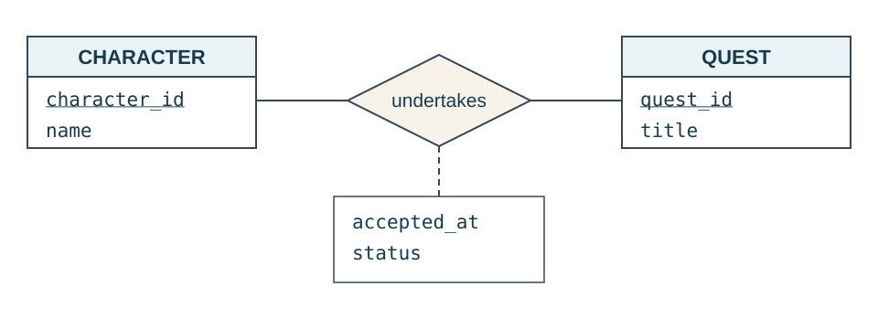
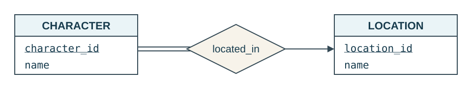
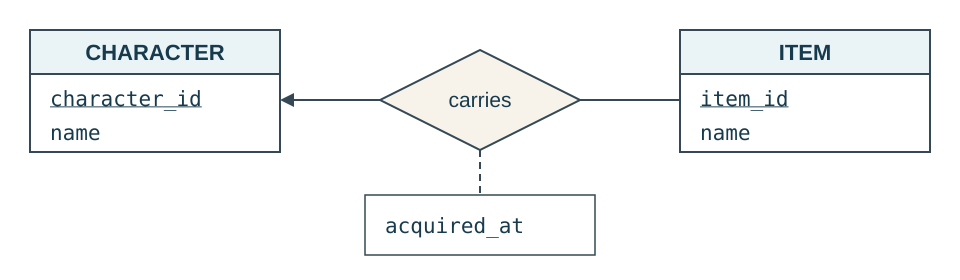
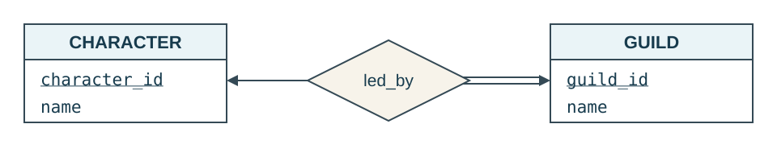
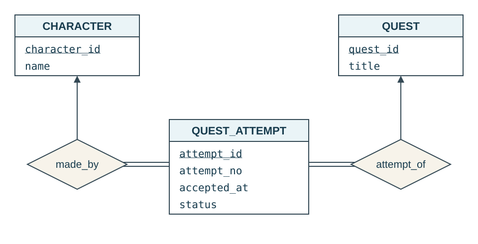

::: {.lesson-hero}
::: {.lesson-kicker}
WEEK 7 · RELATIONSHIP KEYS AND RELATIONAL MAPPING
:::

# What identifies an association, and where do we store it?

In Activity 4, a student's grade belonged to an enrollment, while an instructor could teach several sections. When does a relationship need a new table, and when can we represent it with a foreign key in an existing table?
:::

**Previous:** [Modeling a game world with ER diagrams](week-06-introduction-to-er-diagrams.qmd) · [Activity 4 — ER relationships](../activities/week-07-er-relationship-practice.qmd).

**Focus:** translating binary relationships into tables, foreign keys, and constraints. We keep the book's arrow and single/double-line notation. The cheat sheet and examples give the main mapping rules. We close with repeated quest attempts as a lead-in to weak entities; other nuances stay in the expandable reference.

## 1. Mapping cheat sheet

Start with a table for each entity set. For a binary relationship, use these **default mappings**:

::: {.table-responsive}
| Relationship | Where to store it | Primary key and uniqueness |
|---|---|---|
| **Many-to-many** | Create a relationship table with foreign keys to both entity tables. | Use both participant keys together as the new table's primary key. |
| **One-to-many / many-to-one** | Put a foreign key to the one side in the **many-side table**. | Keep that table's existing primary key. Do not make the foreign key unique. |
| **One-to-one** | Put a foreign key in one entity table, preferably the side with required participation. | Keep that table's existing primary key and make the foreign key **`UNIQUE`**. |
:::

- **Required partner:** make the foreign key `NOT NULL` when every row in the table holding it must have a partner. Otherwise, allow null.
- **Relationship attributes:** store them in the relationship table or alongside the foreign key that represents the relationship.
- **Composite entity keys:** carry over all key columns when creating the reference.

For many-to-many, we choose a primary key for a **new table**. For the other default mappings, we add **foreign keys and constraints to existing tables**. Separate relationship tables are still possible; we will consider those alternatives after the basic examples.

### Keep entity identity separate from relationship storage

A **strong entity** is self-sufficient for identification: its own attributes provide its key. A **relationship** is identified through its participating entities.

- `character_id` identifies a character without needing a location or guild. Requiring a location does not change that identity.
- A character and quest together identify an `undertakes` association; `status` describes it.
- Adding a foreign key records an association. It does not change the entity's primary key or make it dependent for identification.

### Starting entity relations

Start with one relation for each entity set and carry over its key and simple attributes. For the game world, assume these entity relations already exist:

::: {.table-responsive}
| Entity set | SQL table | Primary key | Selected descriptive attributes |
|---|---|---|---|
| `CHARACTER` | `game_character` | `character_id` | `name`, `control_kind` |
| `LOCATION` | `location` | `location_id` | `name` |
| `ITEM` | `item` | `item_id` | `name`, `weight` |
| `GUILD` | `guild` | `guild_id` | `name` |
| `QUEST` | `quest` | `quest_id` | `title`, `reward_gold` |
:::

For the SQL examples, assume these keys are generated integer primary keys. **Foreign keys reuse existing IDs; they do not generate new IDs for the related entity.** The snippets add relationships to these tables; unrelated attributes are omitted.

## 2. Many-to-many: create a relationship table

**Question:** Where should we store each character's progress on each quest?

Our `undertakes` rule allows a character to undertake many quests and a quest to have many participating characters. Each character undertakes a particular quest at most once.

{fig-alt="CHARACTER and QUEST are connected by an undertakes diamond. Neither connection has an arrow, so this is many-to-many. Both connections are single lines, allowing characters and quests with no undertakings. accepted_at and status appear in a relationship-attribute box connected to the diamond by a dashed line."}

::: {.table-responsive}
| character_id | quest_id | status |
|---|---|---|
| 101 | 301 | active |
| 101 | 302 | abandoned |
| 102 | 301 | completed |
:::

### Choose the new table’s primary key

- `character_id` alone fails: character 101 has two quests.
- `quest_id` alone fails: quest 301 has two characters.
- **Choose `(character_id, quest_id)`:** one row represents one pair.

Neither entity row has a single slot for all of its partners. Create a separate relation containing both participant keys and the relationship attributes:

```sql
CREATE TABLE undertakes (
    character_id integer REFERENCES game_character (character_id),
    quest_id integer REFERENCES quest (quest_id),
    accepted_at timestamptz NOT NULL,
    status text NOT NULL
        CHECK (status IN ('active', 'completed', 'abandoned')),
    PRIMARY KEY (character_id, quest_id)
);
```

- Each ID is a **foreign key** to its entity table.
- Together, the IDs are the **primary key**; both are therefore non-null.
- `accepted_at` and `status` describe this character's undertaking of this quest.
- A character with no quests has no matching rows here, but still exists in `game_character`.

**Check:** Can we insert a second row for `(101, 301)` by changing `status` from `active` to `completed`?

<details class="practice-solution">
<summary>Possible answer</summary>

No. The primary key rejects the duplicate pair. Update the existing association's status. Status is not part of its identity.

</details>

## 3. Many-to-one: add a foreign key on the many side

**Question:** Does a character's current location need a separate table?

Each character has exactly one current location. A location may contain many characters or none. In the ER diagram, `located_in` points to `LOCATION`, and `CHARACTER` has total participation.

{fig-alt="CHARACTER, with underlined character_id, connects by double lines to a located_in diamond. A single line with an arrow points from the diamond to LOCATION, whose location_id is underlined. Every character has exactly one location; a location can have zero or many characters."}

### Put the foreign key on the many side

`CHARACTER` is the many side: several characters can share a location. Each character row needs only one location reference, so add the foreign key to `game_character`:

```sql
ALTER TABLE game_character
ADD COLUMN location_id integer NOT NULL
    REFERENCES location (location_id);
```

::: {.table-responsive}
| character_id | name | location_id |
|---|---|---|
| 101 | Mira | 10 |
| 102 | Tobin | 10 |
| 103 | Nessa | 11 |
:::

- **One column per character row** stores at most one current location.
- **`NOT NULL`** requires every character to have a location.
- **The foreign key** requires that location to exist.
- **No `UNIQUE` on `location_id`:** several characters may share it.

**The character's primary key remains `character_id`.** We added a foreign key, not another component of the character's primary key.

The `ALTER TABLE` examples assume empty tables. With existing rows, add the column, populate valid values, and then apply `NOT NULL`.

## 4. One-to-many with optional participation

**Question:** Where should we store an item's current carrier and when it was acquired?

A character may carry many items. An item has at most one carrier and may have none. Assume every recorded carrying association includes an acquisition time.

{fig-alt="CHARACTER and ITEM have underlined character_id and item_id. A carries diamond points toward CHARACTER and has no arrow toward ITEM. Both connections are single lines, allowing either entity to have no association. A dashed line joins acquired_at to the diamond as a relationship attribute."}

### Use the same rule, read in the other direction

`ITEM` is the many side. Add a reference to its carrier and store the relationship's `acquired_at` alongside it. Both columns may be null because an item can be uncarried.

```sql
ALTER TABLE item
ADD COLUMN carrier_id integer REFERENCES game_character (character_id),
ADD COLUMN acquired_at timestamptz,
ADD CONSTRAINT carrying_details_together CHECK (
    (carrier_id IS NULL AND acquired_at IS NULL)
    OR
    (carrier_id IS NOT NULL AND acquired_at IS NOT NULL)
);
```

- `carrier_id` references `game_character.character_id`; the name communicates its role.
- An uncarried item has nulls in both added columns.
- The check keeps the acquisition time together with the association it describes.
- Do not make `carrier_id` unique: one character can carry several items.

**The item's primary key remains `item_id`.** We added relationship columns to an existing entity table. A separate `carries` table is also possible; we will compare that alternative later.

## 5. One-to-one: preserve both uniqueness rules

**Question:** Where should we store a guild's leader?

Every guild has exactly one leader; a character leads at most one guild. Guild leadership is separate from the many-to-many `member_of` relationship.

{fig-alt="A led_by diamond has arrows toward both CHARACTER and GUILD, whose character_id and guild_id are underlined. The CHARACTER connection is a single line; the GUILD connection is doubled. Each guild requires exactly one leader, while a character may lead zero or one guild."}

### Add a unique foreign key

Put `leader_id` on `guild`, the side that must participate. Each guild row stores its leader; `UNIQUE` prevents that character from appearing as another guild's leader.

```sql
ALTER TABLE guild
ADD COLUMN leader_id integer NOT NULL UNIQUE
    REFERENCES game_character (character_id);
```

- One `leader_id` column permits one leader per guild.
- `NOT NULL` requires every guild to have a leader.
- `UNIQUE` prevents a character from leading two guilds.
- The foreign key requires the leader to be an existing character.

**The guild's primary key remains `guild_id`.**

**Without `UNIQUE`, this would allow many guilds to share one leader.** A foreign key alone does not make a relationship one-to-one.

In principle, a one-to-one relationship can be incorporated into either entity relation. Putting a nullable, unique `led_guild_id` on characters would record who leads a guild, but would not by itself ensure every guild has a leader. Total participation makes `guild` the convenient choice here.

## 6. Check the foreign-key constraints

Once you have chosen the table that holds a foreign key, ask:

1. **May several rows refer to the same partner?** If yes, allow repeated foreign-key values. If no, add `UNIQUE`.
2. **Must every row in this table have a partner?** If yes, add `NOT NULL`. Otherwise, allow null.

For our examples:

- **Character → location:** repeated locations are allowed; a location is required. Use `NOT NULL`, without `UNIQUE`.
- **Item → carrier:** repeated carriers are allowed; a carrier is optional. Use neither `UNIQUE` nor `NOT NULL` on `carrier_id`.
- **Guild → leader:** a character can lead only one guild; a leader is required. Use both `UNIQUE` and `NOT NULL`.

For the many-to-many `undertakes` table, each row requires both participants. The composite primary key makes their IDs non-null and prevents duplicate pairs, while allowing either ID to repeat with different partners.

<details>
<summary>Additional reference: relationship keys and alternative mappings</summary>

### Why does the book define a relationship key?

A relationship has an identity even when we store it using columns in an entity table. If we represented each association as a separate row, the book's rules tell us which participant keys would identify that row:

::: {.table-responsive}
| Cardinality | Minimal superkey for the relationship |
|---|---|
| Many-to-many | Both participants' primary keys together. |
| One-to-many or many-to-one | The primary key of the many-side entity. |
| One-to-one | Either participant's primary key. |
:::

These rules assume the stated binary cardinalities and no additional uniqueness requirements. If we create a separate relationship table, we can choose the indicated key as its primary key; for one-to-one, we must also enforce uniqueness of the other participant's key.

**With a foreign-key mapping, we do not declare another primary key.** The existing entity row already identifies the association: `character_id` identifies a character's current-location association, and `guild_id` identifies a guild's leadership association. The relationship-key rules explain why these mappings work.

### Alternative: a separate table for carrying

A separate relationship table can be useful when participation is optional: uncarried items then need no null relationship fields.

```sql
CREATE TABLE carries (
    item_id integer PRIMARY KEY REFERENCES item (item_id),
    character_id integer NOT NULL
        REFERENCES game_character (character_id),
    acquired_at timestamptz NOT NULL
);
```

An uncarried item remains in `item` and has **no row in `carries`**. Each carrying row must identify both participants. Making `character_id` nullable here would create a row that does not represent a carrying association.

Here, **`item_id` is the relationship table's primary key** because an item has at most one carrier. This is where the many-side key rule directly determines a new table's primary key.

Choose either this table or the earlier columns in `item`. Storing both independently would duplicate the same fact. A separate table's foreign keys also do not, by themselves, require every entity to participate; this matters for mandatory associations such as a character's location.

### Would a generated relationship ID work?

For the many-to-many `undertakes` table, yes—but the ID would not by itself enforce the one-association-per-pair rule. An alternative design would use:

```sql
undertaking_id integer GENERATED ALWAYS AS IDENTITY PRIMARY KEY,
-- Keep character_id and quest_id as NOT NULL foreign keys, plus:
UNIQUE (character_id, quest_id)
```

This is a **column/constraint fragment**, replacing the primary key in the earlier `undertakes` definition. A generated ID identifies the row; the `UNIQUE` constraint still prevents duplicate character–quest pairs. This storage choice does not by itself change the ER relationship into an entity.

### Apply the defaults to the remaining relationships

The remaining game relationships follow the same patterns:

- **`member_of`:** a separate relation with primary key `(character_id, guild_id)` and foreign keys to both entity tables. Characters may join multiple guilds.
- **`offers`:** put a non-null `guild_id` foreign key in `quest`. Each quest has one issuing guild; do not make that foreign key unique.

### What does participation change?

Participation determines whether associations must exist, while maximum cardinality determines which participant keys suffice.

- For an embedded foreign key, use `NOT NULL` when that entity must have a partner; allow null when it may have none.
- In a separate relationship table, participant IDs identify an actual association and should be non-null. Optional participation is represented by **no association row**.
- Requiring every character to join a guild does not make membership one-to-many. Characters may still join several guilds, so `member_of` still uses `(character_id, guild_id)`.

### Which rules still need more work?

The simple keys and foreign keys above do not enforce every rule in the game model:

- A `member_of` table with a composite primary key and two foreign keys does not require every guild to have a member.
- `guild.leader_id` referencing `game_character` does not ensure the leader is also a member of that guild.

Keep these requirements with the design. They need additional enforcement beyond the definitions shown; an ordinary row-level `CHECK` cannot inspect other table rows to establish them.

</details>

## 7. Looking ahead: repeated quest attempts

**Question:** What if Mira finishes quest 301 and tries it again, and we want to keep both attempts?

::: {.table-responsive}
| character_id | quest_id | attempt_no | status |
|---|---|---|---|
| 101 | 301 | 1 | completed |
| 101 | 301 | 2 | active |
| 101 | 302 | 1 | abandoned |
| 102 | 301 | 1 | completed |
:::

The first two rows share the same character–quest pair, so that pair no longer identifies one attempt. In the basic ER model, a binary relationship records one association per pair. To distinguish repeated occurrences, model **each attempt as an entity**. There are two ways to identify it.

### Option 1: give the attempt its own ID

Use a globally unique `attempt_id` as the primary key. This makes `QUEST_ATTEMPT` a **strong entity**, self-sufficient for identification.

{fig-alt="CHARACTER and QUEST are rectangles with underlined character_id and quest_id. A third rectangle, QUEST_ATTEMPT, has underlined attempt_id and descriptive attempt_no, accepted_at, and status. The made_by diamond has an arrow toward CHARACTER, and attempt_of has an arrow toward QUEST. Double lines connect QUEST_ATTEMPT to both diamonds. Thus each attempt requires exactly one character and one quest; either character or quest can have zero or many attempts."}

- Each attempt belongs to exactly one character and one quest: apply our many-to-one rule twice, using two non-null foreign keys in `quest_attempt`.
- If we also keep local attempt numbers, make the character ID, quest ID, and attempt number **unique together**.

### Option 2: identify the attempt through its context

Instead of adding `attempt_id`, use:

```sql
PRIMARY KEY (character_id, quest_id, attempt_no)
```

- `attempt_no` is local to a character–quest pair; it is not globally unique.
- The character, quest, and local number together identify the attempt. This is the **weak-entity** option: identification depends on other entities.
- Both designs allow retries. Making the character–quest pair unique would prohibit them.

**Both options model attempt entities.** The difference is independent versus dependent identification, not simply a single-column versus composite key. The diagram shows Option 1; we will return to Option 2 when introducing weak-entity notation.

<details>
<summary>SQL reference for the two attempt designs</summary>

For Option 1, use this table in place of `undertakes`:

```sql
CREATE TABLE quest_attempt (
    attempt_id integer GENERATED ALWAYS AS IDENTITY PRIMARY KEY,
    character_id integer NOT NULL REFERENCES game_character (character_id),
    quest_id integer NOT NULL REFERENCES quest (quest_id),
    attempt_no integer NOT NULL CHECK (attempt_no > 0),
    accepted_at timestamptz NOT NULL,
    status text NOT NULL
        CHECK (status IN ('active', 'completed', 'abandoned')),
    UNIQUE (character_id, quest_id, attempt_no)
);
```

For Option 2, omit `attempt_id` and replace the three-column `UNIQUE` constraint with the composite primary key shown above. Keep the foreign keys, non-null columns, and checks. These are alternative definitions of one table.

PostgreSQL generates `attempt_id`; the application supplies `attempt_no`. The constraints require positive, unique local numbers, but do not generate them or require consecutive numbering.

</details>

**Next:** extend ER modeling with minimum–maximum notation, weak entities, and other modeling choices. We will revisit quest attempts to show dependent identification in an ER diagram, alongside the relational representations of these concepts.

## Reference and reading

Silberschatz, Korth, and Sudarshan, *Database System Concepts*, 7th edition:

- **Section 6.5.2:** relationship keys, pp. 257–258.
- **Section 6.5.3:** weak entities and identification using one or more identifying entity sets, pp. 259–260 (preview).
- **Section 6.9.3:** choosing entity sets versus relationship sets, pp. 282–283.
- **Sections 6.7.1 and 6.7.4:** representing entity and relationship sets as relations.
- **Section 6.7.6:** combining relationship and entity schemas, including optional participation and nulls, pp. 270–271.

The [Chapter 6 slides](https://www.db-book.com/slides-dir/PDF-dir/ch6.pdf) cover binary relationship keys on slides 6.36–6.37 and relationship mapping/combining schemas on slides 6.49–6.51. The examples here adapt these ideas to our game world and Activity 4. PostgreSQL details: [primary, unique, check, and foreign-key constraints](https://www.postgresql.org/docs/current/ddl-constraints.html).
